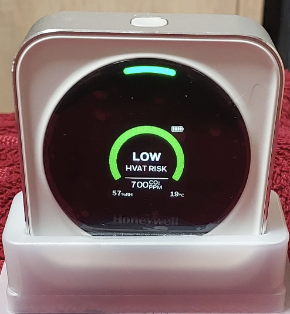
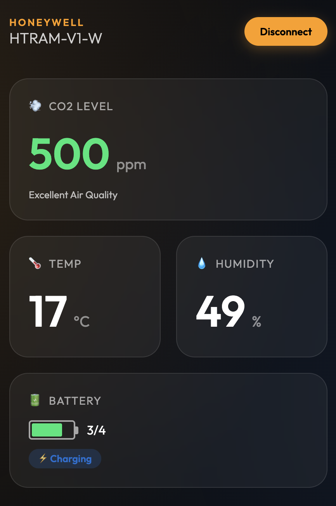

# Honeywell Air Monitor (HTRAM-V1-W) Bluetooth Monitor


-000000?style=flat-square&logo=apple&logoColor=white)

<p align="center">
  
  &nbsp;&nbsp;&nbsp;&nbsp;
  
</p>

## 🚀 [**Launch Web Dashboard (Try it Online)**](https://noname122021.github.io/honeywell-htram-v1w-ble-monitor/web/)

This repository contains a professional suite of tools for monitoring and logging data from the **Honeywell Air Monitor (Model: HTRAM-V1-W)** via Bluetooth Low Energy (BLE). It includes both a robust **Python backend** and a modern **Web Bluetooth Dashboard**.

---

## 🚀 Choose Your Monitor

| Method | Best For | Status |
| :--- | :--- | :--- |
| **[Web Dashboard](#-web-bluetooth-dashboard)** | Quick check, zero installation, beautiful UI | **Recommended** |
| **[Python Script](#-python-monitoring-utility)** | Long-term logging, smart home integration, automation | **Production** |

---

## Technical Overview

The Honeywell HTRAM device uses a proprietary BLE protocol. While it broadcasts standard GATT services, real-time sensor data is retrieved through a specific Request-Response (Polling) mechanism on a custom service.

### BLE GATT Configuration
*   **Service (Custom):** `fc247940-6e08-11e4-80fc-0002a5d5c51b`
*   **Write Characteristic (Commands):** `3d115840-6e0b-11e4-b24f-0002a5d5c51b`
*   **Notify Characteristic (Data Stream):** `f833d6c0-6e0b-11e4-9136-0002a5d5c51b`

### Protocol Documentation
> **Note:** For advanced details on **Firmware Updates** and **WiFi/Zigbee commands**, see the full [**Protocol Reference**](PROTOCOL.md).

#### 1. Initialization
The device typically expects an initialization command to set the BLE mode upon connection.
*   **Command:** `7b 41 00 0c 74 58 01 01 00 4e 08 7d`

#### 2. Requesting Data
The device does not stream data automatically by default. To receive updates, the client must poll the device by writing to the **Write Characteristic**.
*   **Real-time Data Request:** `7b 41 00 07 40 44 02 00 fc 3e 7d`

#### 3. Response Format (Header: `0x4144`)
| Offset | Length | Description | Format |
| :--- | :--- | :--- | :--- |
| 7-8 | 2 bytes | CO2 Concentration | Big-Endian (ppm) |
| 9 | 1 byte | Temperature | Signed Integer (°C) |
| 10 | 1 byte | Humidity | Integer (%) |
| 11 | 1 byte | Battery Level | Index (0=Empty, 4=Full) |
| 12 | 1 byte | Charging Status | Boolean (1=Yes, 0=No) |

---

## 🌐 Web Bluetooth Dashboard

For a zero-installation experience, use the modern Web UI inspired by the ATC1441 projects.

### Browser Compatibility
*   **Desktop:** Chrome, Edge, Opera (macOS, Windows, Linux).
*   **Android:** Chrome for Android.
*   **iOS (iPhone/iPad):** Not supported in Safari. Use the [**Bluefy Web Ble Browser**](https://apps.apple.com/app/bluefy-web-ble-browser/id1492822232) from the App Store.

### How to use:
1. **Open Online:** [**Launch Web Dashboard**](https://noname122021.github.io/honeywell-htram-v1w-ble-monitor/web/)
2. **On iPhone:** Use the link inside the **Bluefy** browser.
3. Ensure your sensor is in pairing mode (Bluetooth icon flashing).
4. Click **Connect Device** and select your sensor.

---

## 🐍 Python Monitoring Utility

The Python script is ideal for **24/7 logging**, **home automation integration**, and running as a **background service**.

### Installation & Setup

#### Step 1: Install Python Dependencies
```bash
# Navigate to the project directory
cd honeywell-htram-v1w-ble-monitor

# Create a virtual environment (recommended)
python3 -m venv .venv
source .venv/bin/activate  # On Windows: .venv\Scripts\activate

# Install required packages
pip install bleak
```

#### Step 2: Pair Your Device (First Time Only)
1. **Enable pairing mode** on your Honeywell sensor:
   - Double-press the top button until the Bluetooth icon starts **flashing**
2. **Pair via your OS Bluetooth settings** (not required on all systems, but recommended):
   - macOS: System Settings → Bluetooth → Connect to "HTRAM-..."
   - Windows: Settings → Bluetooth & devices → Add device
   - Default PIN (if prompted): `000000` or `123456`

#### Step 3: Run the Script
```bash
# Auto-discover and start monitoring
python air_monitor.py

# Or use the full path to the virtual environment
.venv/bin/python air_monitor.py
```

---

### Command-Line Arguments

| Argument | Type | Description | Example |
|:---------|:-----|:------------|:--------|
| `--mac` | String | Target a specific sensor by MAC address | `--mac "AB:CD:EF:01:02:03"` |
| `--dashboard` | Flag | Enable full-screen terminal dashboard | `--dashboard` |
| `--interval` | Integer | Polling interval in seconds (default: 5) | `--interval 10` |
| `--history` | Flag | Download 90-day history log and exit | `--history` |

---

### Usage Examples

#### 1. Basic Real-Time Monitoring (Default)
```bash
python air_monitor.py
```
**Output:**
```
Scanning for Honeywell HTRAM...
Connected to XX:XX:XX:XX:XX:XX
Syncing time with device: 7b41000c224201YYMMDDHHMMSS<CRC>7d
[13:33:22] Time synchronization confirmed by device.
Starting real-time monitoring (Interval: 5s)...
[13:33:23] ID: XXXXXXXXXXXX | CO2:  600 | T: 19°C | H: 40% | Bat: 4 | Chg: Yes
[13:33:28] ID: XXXXXXXXXXXX | CO2:  605 | T: 19°C | H: 40% | Bat: 4 | Chg: Yes
```
- Logs are saved to `air_log_[MAC]_[DATE].csv`
- New file created daily at midnight
- Press `Ctrl+C` to stop

#### 2. Dashboard Mode (Visual Terminal UI)
```bash
python air_monitor.py --dashboard
```
**Output:**
```
=======================================================
 HONEYWELL AIR MONITOR | ID: XXXXXXXXXXXX | 13:33:22
=======================================================
 CO2 Concentration:   600 ppm
 Temperature:          19 °C
 Humidity:             40 %
 Battery Level:       4/4
 Charging Status:     Yes
-------------------------------------------------------
 Logging to: air_log_XXXXXXXXXXXXXXXXXXXXXXXXXXXX_2026-01-01.csv
 [Press Ctrl+C to stop]
```

#### 3. Download Historical Data (90 Days)
```bash
python air_monitor.py --history
```
**What happens:**
1. Connects to the device
2. Syncs time (crucial for accurate timestamps)
3. Downloads all stored measurements (up to ~90 days)
4. Saves to `history_[MAC].csv`
5. Exits automatically

**Output:**
```
Scanning for Honeywell HTRAM...
Connected to XX:XX:XX:XX:XX:XX
Syncing time with device: 7b41000c224201YYMMDDHHMMSS<CRC>7d
[13:33:22] Time synchronization confirmed by device.
Fetching historical data log from device memory...
  Downloading block at ffffffff...
  Downloading block at 00200000...
  Downloading block at 00200080...
  ...
Download complete. Records found: 896
Saved historical log to history_XXXXXXXXXXXXXXXXXXXXXXXXXXXX.csv
```

**CSV Format:**
```csv
Timestamp_UTC,CO2_ppm,Temp_C,Humidity_pct
2025-12-02 10:15:30,450,22,45
2025-12-02 10:16:30,455,22,45
...
```

#### 4. Monitor Specific Device with Custom Interval
```bash
python air_monitor.py --mac "XX:XX:XX:XX:XX:XX" --interval 10
```
- Targets a specific sensor (useful for multi-device setups)
- Polls every 10 seconds instead of default 5

#### 5. Fetch History + Continue Monitoring
```bash
python air_monitor.py --history --dashboard
```
- Downloads history first
- Then switches to live dashboard mode
- Useful for initial data collection + ongoing monitoring

---

### Advanced Features

#### 🕒 Automatic Time Synchronization
- **Why it matters:** The device has no built-in real-time clock (RTC)
- **What it does:** Sets the device's internal time to your system's UTC time on every connection
- **Impact:** Ensures all future historical records have accurate timestamps
- **When it happens:** Automatically after connecting, before any data requests

#### 📜 90-Day History Storage
- **Capacity:** Device stores approximately 90 days of measurements (1-minute intervals)
- **Persistence:** Reading history does NOT delete it from the device
- **Format:** Each record contains: Unix Timestamp, CO2, Temperature, Humidity
- **Retrieval:** Non-destructive block-based download (128 bytes per block)

#### 🔄 Auto-Reconnection
- **Behavior:** If Bluetooth connection drops, script automatically retries every 10 seconds
- **Use case:** Long-term monitoring in environments with occasional interference
- **Status:** Connection errors are logged but don't crash the script

#### 📁 Daily Log Rotation
- **File naming:** `air_log_[MAC]_YYYY-MM-DD.csv`
- **Rotation:** New file created at midnight (local time)
- **Headers:** Automatically added to new files
- **Location:** Same directory as the script

---

### Troubleshooting

**Problem:** `No HTRAM devices found`
- **Solution:** Ensure device is in pairing mode (Bluetooth icon flashing). Double-press top button.

**Problem:** `Connection error: Bluetooth device is turned off`
- **Solution:** Enable Bluetooth on your computer. On macOS: System Settings → Bluetooth.

**Problem:** `Permission denied` or `Access denied`
- **Solution:** On Linux, add your user to the `bluetooth` group: `sudo usermod -a -G bluetooth $USER`

**Problem:** History download shows old/incorrect dates
- **Solution:** This is normal if the device was never time-synced before. Future records will be accurate after the first sync.

---

## 🌐 Web Bluetooth Dashboard

The web dashboard provides a **zero-installation**, **cross-platform** monitoring experience with a beautiful UI.

### Features
- ✅ **Real-Time Monitoring:** Live CO2, Temperature, Humidity, Battery, and Charging status
- ✅ **Historical Data Viewer:** Download and visualize up to 90 days of CO2 data with an interactive chart
- ✅ **Automatic Time Sync:** Device clock is synchronized on connection
- ✅ **Device History:** Remembers previous connections for quick one-click access
- ✅ **No Installation Required:** Works directly in your browser
- ✅ **Responsive Design:** Adapts to desktop, tablet, and mobile screens

### Browser Compatibility

| Platform | Browser | Status |
|:---------|:--------|:-------|
| **Windows** | Chrome, Edge, Opera | ✅ Fully Supported |
| **macOS** | Chrome, Edge, Opera | ✅ Fully Supported |
| **Linux** | Chrome, Chromium, Opera | ✅ Fully Supported |
| **Android** | Chrome for Android | ✅ Fully Supported |
| **iOS/iPadOS** | Safari | ❌ Not Supported |
| **iOS/iPadOS** | [Bluefy Browser](https://apps.apple.com/app/bluefy-web-ble-browser/id1492822232) | ✅ Supported |

### How to Use

#### Option 1: Online (Recommended)
1. **Open the dashboard:** [**Launch Web Dashboard**](https://noname122021.github.io/honeywell-htram-v1w-ble-monitor/web/)
2. **On iPhone/iPad:** Copy the link and open it in the **Bluefy** browser (free from App Store)
3. **Prepare your device:**
   - Double-press the top button until Bluetooth icon flashes
4. **Connect:**
   - Click **"Connect Device"**
   - Select your sensor from the list (e.g., "HTRAM-...")
   - Wait for connection (status will show "Connected")

#### Option 2: Local (Offline)
1. Clone or download this repository
2. Open `web/index.html` in Chrome/Edge
3. Follow the same connection steps as above

### Using the History Viewer

1. **Connect to your device** first (see above)
2. **Click "Fetch History Log"** button (appears after connection)
3. **Wait for download:**
   - Status will show progress: "Fetching block at ..."
   - Download takes ~30-60 seconds for 90 days of data
   - Chart updates in real-time as data arrives
4. **View the chart:**
   - Interactive CO2 timeline (hover to see exact values)
   - Zoom: Scroll on the chart
   - Pan: Click and drag
5. **After completion:**
   - Real-time monitoring resumes automatically
   - Chart remains visible for analysis

### Troubleshooting

**Problem:** "Bluetooth not available" error
- **Solution:** Ensure Bluetooth is enabled in your OS settings and you're using a supported browser.

**Problem:** Device list is empty when connecting
- **Solution:** 
  1. Ensure device is in pairing mode (Bluetooth icon flashing)
  2. Refresh the page and try again
  3. On some systems, you may need to pair via OS Bluetooth settings first

**Problem:** History download stops at "Fetching block at ..."
- **Solution:** 
  - This is normal if device has no more data
  - Wait 8 seconds for automatic timeout
  - Real-time monitoring will resume automatically

**Problem:** Chart shows incorrect dates
- **Solution:** Device time is synced automatically on connection. Future records will be accurate.

**Problem:** Connection drops during history download
- **Solution:**
  - Move closer to the device
  - Ensure device battery is not critically low
  - Try again with slower download (this is automatic in the latest version)

---

### Hardware Pairing Notes
1. **Pairing Mode:** Double-press the top physical button until Bluetooth icon flashes
2. **PIN Code:** Usually `000000` or `123456` (most systems don't require it)
3. **Range:** Bluetooth Low Energy typically works up to 10 meters (30 feet) in open space
4. **Battery:** Ensure device is charged or plugged in for reliable history downloads

---

## 📊 Data Format & Storage

### Real-Time CSV Logs (`air_log_[MAC]_[DATE].csv`)
```csv
Timestamp,CO2_ppm,Temp_C,Humidity_pct,Battery_Level,Charging
2026-01-01 13:33:23,600,19,40,4,Yes
2026-01-01 13:33:28,605,19,40,4,Yes
```

### Historical CSV Logs (`history_[MAC].csv`)
```csv
Timestamp_UTC,CO2_ppm,Temp_C,Humidity_pct
2025-12-02 10:15:30,450,22,45
2025-12-02 10:16:30,455,22,45
```

**Note:** Historical logs use UTC timestamps. Real-time logs use local time.

---

## Legal Disclaimer
This information and the accompanying scripts are for educational and interoperability purposes only. All product names, logos, and brands are property of their respective owners.
